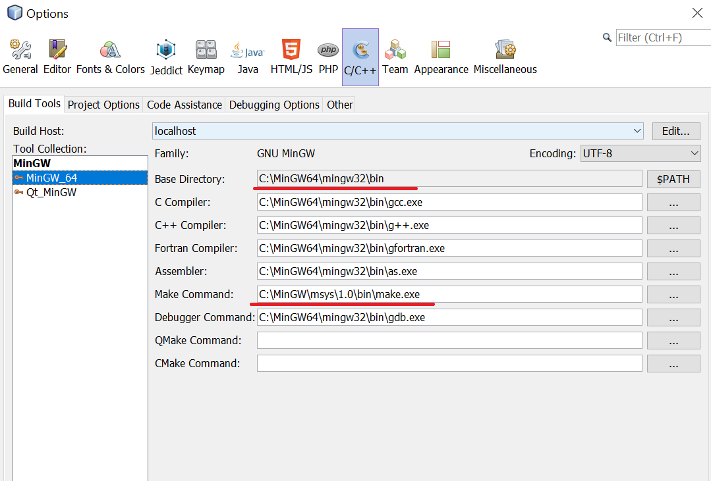

# To use C++11 threads under windows MinGW-64 should be installed

- download MinGW64 exe installer from:
    [Mingw64- SourceForge](https://sourceforge.net/projects/mingw-w64/)

- install in C:\MinGW64

- download MSYS from
    [MSYS] (https://sourceforge.net/projects/mingw-w64/files/External%20binary%20packages%20%28Win64%20hosted%29/MSYS%20%2832-bit%29/)

- install MSYS

- add in PATH MSYS and MinGW: C:\MinGW\msys\1.0\bin;C:\MinGW64\mingw32\bin; 

- in Netbeans Tools/Options/C++ in Build Tools add new build collection's base directory : C:\MinGW64\mingw32\bin

 
